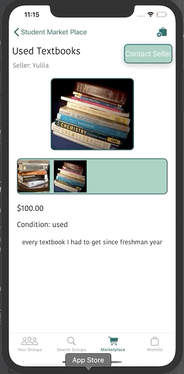

# PeerFinder
Hackaton Project
Peer Finder: The app for college students to connect with students from their college for study groups, clubs, events and marketplace for school essentials.

Users can follow groups from their school and see them on their main feed.
They can filter groups by Study groups, Clubs, or Events.
Users can comment to the groups and see them on the groups page.
<br />


Users can search for new groups to follow.


Users can also create their own groups.


There is also a Student Marketplace where users can buy or sell items.
Users can view items up for sale and contact the seller by email or text message.


Users can add items to their wishlist or remove them.



Users also have the ability to add items to the market place.


<br />

## Contributors

[Howard Chang](https://github.com/howardC56)
[Maitree Bain](https://github.com/maitreebain)
[Casandra Grullon](https://github.com/CasandraGrullon)
[Yuliia Engman](https://github.com/YuliiaEngman)

## The api was created on Firebase and relies on crowdsourcing to add more data.
```swift
    public func createGroup<T: Codable & Identifiable>(_ item: T, completion: @escaping (Result<Bool, Error>) -> ()) {
        let document = db.collection(DatabaseService.groupsCollection).document(item.id as! String)
        do {
            try document.setData(from: item)
            completion(.success(true))
        } catch let error {
            completion(.failure(error))
        }
    }
    
    public func deleteGroup<T: Codable & Identifiable>(_ item: T, completion: @escaping (Result<Bool, Error>) -> ()) {
            db.collection(DatabaseService.groupsCollection).document(item.id as! String).delete { (error) in
                    if let error = error {
                        completion(.failure(error))
                    } else {
                        completion(.success(true))
                    }
        }
    }
    
    public func getGroups<T: Codable>(item: T.Type, completion: @escaping (Result<[T], Error>) -> ()) {
        db.collection(DatabaseService.groupsCollection).getDocuments { (snapshot, error) in
                if let error = error {
                    completion(.failure(error))
                } else if let snapshot = snapshot {
                    let items = snapshot.documents.compactMap { try? $0.data(as: T.self) }
                    completion(.success(items))
        }
    }
  }
```

## Allowing the user to contact the seller by email or text message required us to implement MessageUI
```swift
private func showMailComposer() {
        
        guard MFMailComposeViewController.canSendMail() else {
            //show alert
            DispatchQueue.main.async {
                self.showAlert(title: "Device Error", message: "Your device cannot send e-mails")
            }
            return }
        
        let composer = MFMailComposeViewController()
        composer.mailComposeDelegate = self
        composer.setToRecipients([item.sellerEmail])
        composer.setSubject("Interested in \(item.itemName)")
        composer.setMessageBody("I would like to purchase the item listed", isHTML: false)
        present(composer, animated: true)
    }
    
    private func showMessageComposer() {
        
        if !MFMessageComposeViewController.canSendText() {
            DispatchQueue.main.async {
                self.showAlert(title: "Device Error", message: "Your device cannot send e-mails")
            }
        }
        
        let messageComposer = MFMessageComposeViewController()
        messageComposer.body = "Hi! I'm interested in this item that you're selling."
        messageComposer.recipients = ["3474699643"]
        messageComposer.messageComposeDelegate = self
        
        guard let image = itemDetailView.imageView.image else { return }
        
        if let imageData = image.pngData(){
            messageComposer.addAttachmentData(imageData, typeIdentifier: "public.data", filename: "item_image.png")
        }else {
            DispatchQueue.main.async {
                self.showAlert(title: "No image selected", message: "Did not attach an image to message")
            }
        }
        present(messageComposer, animated: true)
    }
    
}
```
